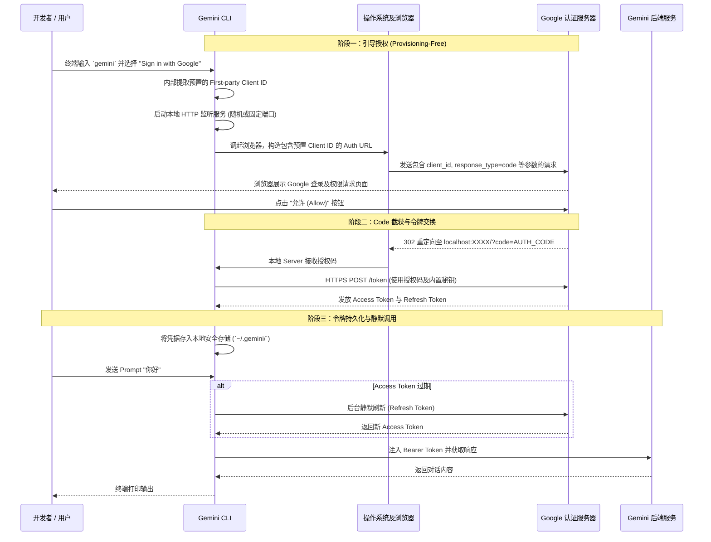

# Gemini CLI OAuth 认证与底层架构工作流

本文档从程序运作的纯技术视角，详细拆解了 Gemini CLI 采用的 **OAuth 2.0 桌面应用程序授权码流** 的运作全流程，并深入探讨了其与传统工具（如 `gws`）在凭据管理上的核心差异。

## 1. 核心流程时序图

Gemini CLI 的认证旨在实现“零配置”启动，用户只需点击登录，无需接触 Google Cloud 控制台。

## 2. 深度对比：为什么 Gemini CLI 不需要创建 Client ID？

这是 Gemini CLI 与 `gws` (Google Workspace CLI) 在设计哲学上的最大区别。

### A. GWS CLI 的“自驱动”模式
在 `gws` 的流程中，用户通常需要执行 `auth setup` 或手动在 GCP 控制台创建项目。
*   **原因**：`gws` 操作的是用户私有的 Workspace 数据（如云盘、邮件）。为了确保审计安全和配额隔离，Google 要求此类三方工具使用用户自己申请的 `client_id`。
*   **代价**：用户必须具备 GCP 项目管理权限，且需经历繁琐的“创建项目 -> 启用 API -> 配置同意屏幕 -> 下载 JSON”流程。

### B. Gemini CLI 的“集成式”模式
Gemini CLI 内部**内置了官方第一方 Client ID 和 Secret**。
*   **实现原理**：Gemini CLI 被视为 Google 官方提供的“已验证应用”。它预先在 Google 内部注册了全局通用的凭据，这些凭据直接硬编码或加密嵌入在二进制程序中。
*   **优势**：
    *   **零摩擦 (Zero Friction)**：用户无需访问 Google Cloud 控制台，只需像登录网页版 Gmail 一样授权即可。
    *   **即开即用**：免去了管理 GCP 项目、API 启用状态等运维负担。
*   **安全性考量**：虽然 Client ID 是内置的，但最终的 `access_token` 依然绑定在具体的 Google 账户上，符合最小权限原则。

## 3. 认证原理解析与运行阶段分解

### 阶段一：内置凭据提取 (Internal Provisioning)
不同于 `gws` 需要从外部读取 `credentials.json`，Gemini CLI 在启动时：
1.  **加载预置标识**：从程序代码段中读取由 Google 官方分发的 Client ID。
2.  **构造授权请求**：生成的 URL 指向 Google 统一的 OAuth 2.0 端点，但 `redirect_uri` 严格锁定为本地回路地址。

### 阶段二：浏览器交互与本地截获
1.  **动态监听**：CLI 在本机开启监听。Gemini CLI 往往能更智能地处理端口冲突，如果 8080 被占用，它会自动尝试其他可用端口。
2.  **安全闭环**：由于使用了第一方凭据，Google 登录页面通常会显示官方认证图标，增强了用户信任感。

### 阶段三：令牌的生命周期维护
*   **持久化策略**：凭据存储在 `~/.gemini/` 目录下。该目录权限通常被严格限制为 `0700`，以防本地其他用户窃取令牌。
*   **静默刷新**：Gemini CLI 采用了高度封装的 `TokenSource` 接口。在执行任何 AI 推理请求前，它都会自动检查令牌有效性，并在后台完成刷新动作，用户在终端完全感知不到刷新过程。

## 4. 关键差异汇总表

| 特性 | GWS CLI (`gws`) | Gemini CLI (`gemini`) |
| :--- | :--- | :--- |
| **Client ID 来源** | 用户在 GCP 控制台手动创建 | Google 官方内置 (First-party) |
| **GCP 项目依赖** | 用户必须拥有/管理一个 GCP 项目 | 无需用户管理 GCP 项目 |
| **配置成本** | 高 (需 5-10 分钟配置流程) | 极低 (仅需登录) |
| **审计主体** | 用户自己的 GCP 项目日志 | Google 官方服务日志 |
| **适用人群** | IT 管理员 / 资深开发者 | 普通开发者 / AI 用户 |
| **重定向处理** | 通常固定端口 (如 8080) | 更加动态且容错性更强 |
