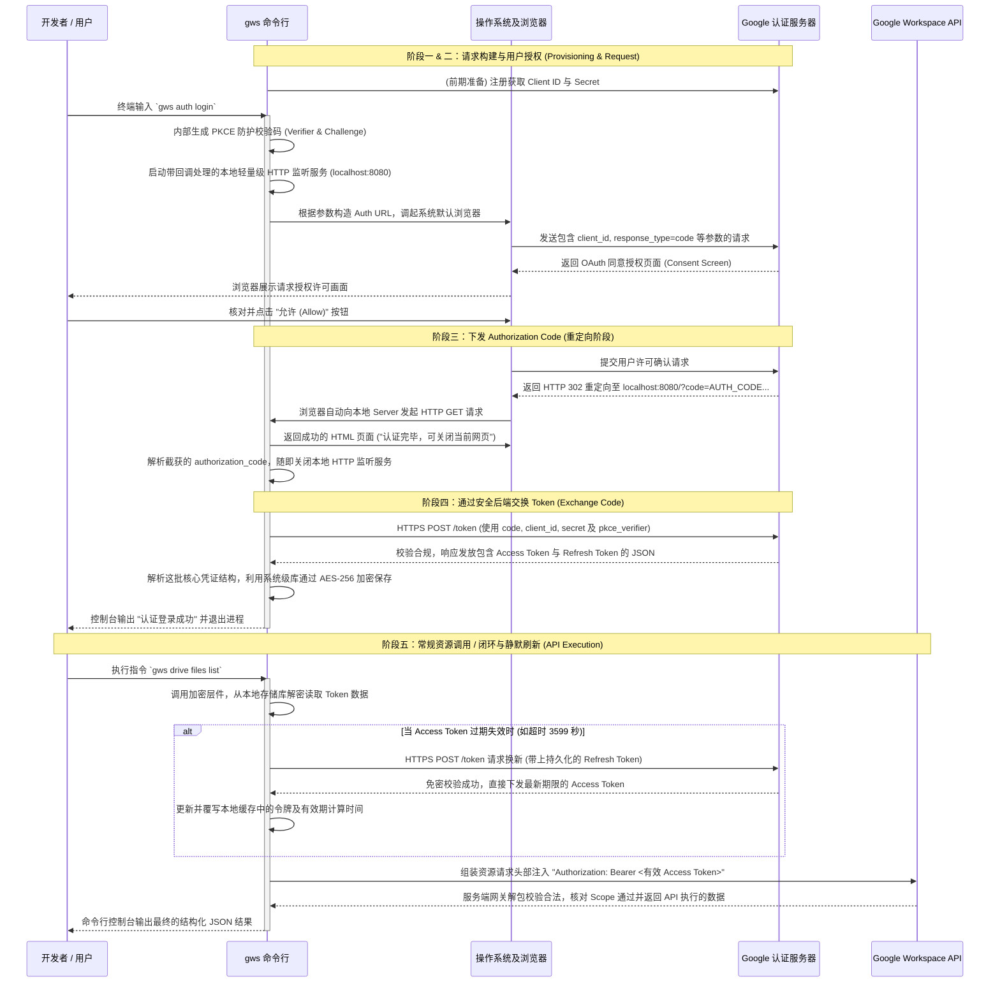

# Google Workspace CLI (gws) OAuth 认证与底层架构工作流

本文档从程序运作的纯技术视角，按时间线详细拆解了 `gws` (Google Workspace CLI) 依赖的 **OAuth 2.0 桌面应用程序授权码流（Authorization Code Flow for Desktop Apps 包含 PKCE 机制）** 的运作全流程。

## 核心流程时序图

以下是完整的 OAuth 2.0 工作流的运作分解图（包含前端调起、PKCE 拦截、以及持久化凭据置换和令牌刷新的全周期行为）：

## 认证原理解析与运行阶段分解

当我们执行涉及 Google API 调用的 `gws` 命令时，底层的交互可高度解耦为以下 5 个阶段。

### 阶段一：前期准备 (Provisioning & Registration)
在这步，主要完成应用端在 Google 认证中心（Authorization Server）的身份报备登记。
1. **项目分配与配置**：如果是 `gws auth setup` 自动运行，脚本会在后台代为调用 GCP API 隐式创建一个项目。若手动操作，开发者则需登录 Cloud 控制台自主建立 Project。
2. **生成 OAuth Credentials**：
   * 在控制台配置 OAuth 应用层级为 **Desktop app（桌面应用）**。
   * Google 随即生成供客户端表明身份的硬编码识别对象：`client_id` 以及用来验证合法性的 `client_secret`。
   * `gws` 获取到了这组身份底账后，就有资格在接下来声明并申请使用相关 Google 服务。

### 阶段二：授权请求构造与终端拦截
在这个阶段，由于 CLI 命令行工具无法像桌面/移动 App 那样展现复杂的 GUI 交互与内嵌网页，因此必须借助系统默认浏览器打通与用户层的确认授权机制。
1. **挂载回调监听器**：
   `gws` 程序会在本机开启一个极轻量级的 HTTP 监听 Server，专供重定向拦截使用 (例如：`http://localhost:8080`)。
2. **组装 Authorization URL (生成请求握手)**：
   CLI 拼接出一个访问 Google Auth 端点地址的完整连接，携带了如下参数信息以表明述求：
   * `response_type=code`：告知 Google 启用 Authorization Code Flow。
   * `client_id` / `redirect_uri`：出示自己的工牌号，并表明请将授权后的放行信道指向我的 Localhost 服务。
   * `scope`：一串描述我们要操作什么接口集合的范围声明（如 Drive、Gmail 等 URI）。
   * `state` 与 `code_challenge`：生成 PKCE (Proof Key for Code Exchange) 哈希串，用于防范 CSRF 被挟持冒认。
3. **调起浏览器**：
   通过操作系统层面封装调起外部默认浏览器，用户从终端自然地平滑过渡到基于网页安全沙盒下的 OAuth 权限勾选与核准。

### 阶段三：获取 Authorization Code (一次性授权码)
用户在网页端确信目标应用安全无害，完成“Allow”确认核准后，操作主权回归进程。
1. **Google 许可放行颁发 Code**：认证服务器在接到用户许可后，生成了一串生命范围极短、且仅供单次核准交换的 **`authorization_code` (授权码)**。
2. **触发本地 HTTP 302 重定向**：由于早前定义了特定的 Redirect URI，Google 服务端将回应转交为一次至 `http://localhost:8080/` 回调通道的地址重定向。
3. **解析与 Server 销毁**：
   通过系统底层端口接连的网络通讯，挂起的 `gws` HTTP Server 捕获到了该 GET 连接的内容，从中解析得出上游抛落的 `code`。随后进程即刻下发一个前端 HTML 文件通知用户可安全关闭标签页，并销毁该 Localhost 监听挂载。

### 阶段四：通过防伪信道交换最终 Token
完成第一阶段握手确认后，工具必须置换出真正有能力参与资源拉取的 Access Token。这通过最私密且基于后端 HTTPS POST 请求的过程完成。
1. **组装 POST 向 Token Endpoint 置换请求**：
   当前 `gws` 程序持有的并非真正意义的 API 使用钥匙。通过 `POST` 向 `https://oauth2.googleapis.com/token` 发送组合认证：
   * 包含上一步拿到的 `authorization_code`；
   * 发送证明自己的 `client_id` 以及保密的 `client_secret`；
   * 发送对应的在第一步内部产生的 `code_verifier`，此时 Google 认证中心将以它进行 Hash 与刚才记录的 Challenge 数据进行配对。
2. **签发与序列化存储策略 (凭证闭环)**：
   安全校验全部吻合，目标服务器会回下发 JSON 构成的核心权柄文件，这通常包含了高频的门禁钥匙 `access_token` 与用来在未来置换续命的免密钥匙 `refresh_token` 等信息。
   考虑到核心密钥数据不能随意明文摆放在配置文件中，`gws` 通常利用底层宿主机带来的密钥机制（如 Mac 的 Keychain 加密，配合 AES-256-GCM 等防范算法）实现数据凭证的高强度静态落地持久化。

### 阶段五：资源调用与刷新循环 (API Execution)
进入真正的常序命令调用与工具运行阶段。假设此刻执行指令为 `gws drive files list`。
1. **读取验证与解密提取**：
   首先试图从系统底层凭据管理栈提取上述落地的核心密钥，进行解密与内部反序列化。利用 `now()` 和它的发放时间与生效周期间隔计算有效状态。
   * 如果仍旧在有效区间內（如 3599 秒以内）：继续直达底层资源请求。
   * 如果已过期：自动调起后台刷新动作，隐式利用 `grant_type=refresh_token` 去 Google 端口置换回一颗全新时效范围的 `access_token`，将本地时间与令牌对象实施刷新覆盖。
2. **上游服务资源读取**：
   由内置的 HTTP Client 构建指定资源节点的查询需求（如向 Drive URL 端点发起 GET 查询），并在请求头的 Header 空间中追加标准协议所需的头文件信息：`Authorization: Bearer <有效存活的access_token>`。
3. **执行与控制台回送**：
   Google 的相关微服务上游网关层收到这则 Bearer 数据后进行快速自证查验，核对其 Scope 效力区间。随后网关放行，目标接口返回真实的业务数据载荷，最后由 CLI 分析响应结构并通过 JSON 编排展现至用户的控制台上。
